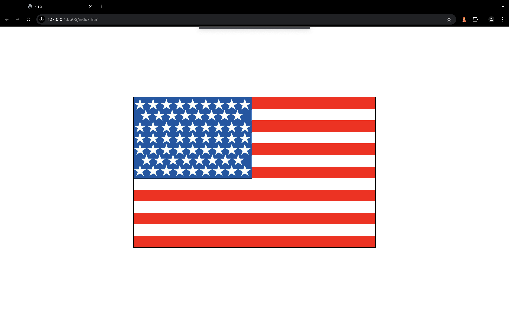

# Flag

Utilizing a table with different styles, create an image of the American flag and you will reproduce it entirely in CSS.

## Technologies

- HTML
- CSS

## Screenshots

## Deployment

To deploy this project click on the next link

https://johanh0.github.io/Flag/

## 🔗 Links

